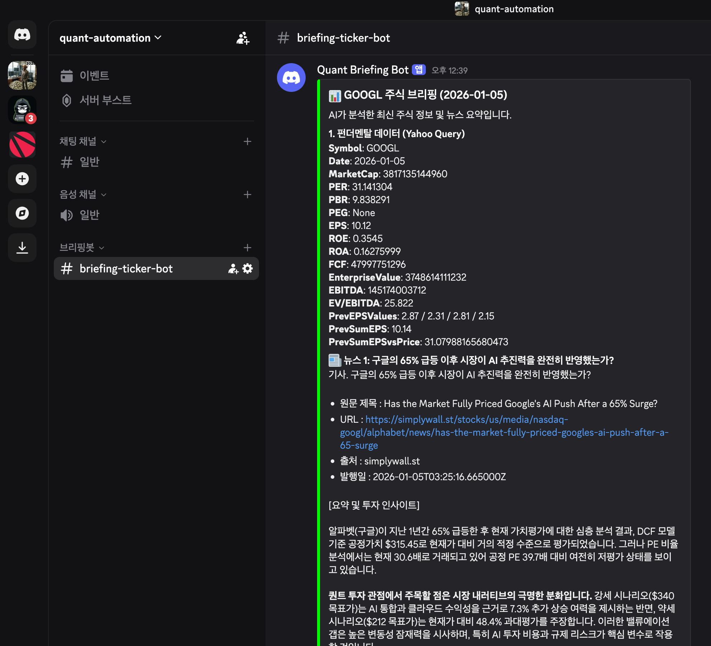

이 Repository 의 용도는 Quant Practice + Quant 데이터 조회 자동화 공방입니다.✨ 

> 한국에서 퀀트 세계 챔피언이 나왔다고 하던데 나도 한번... 나는 그냥 구경해보고 싶따!! (농담이에요!!) 

 
 

## 🚦 In Progress 
## 브리핑 봇 (90%)
- (1) Fundamental 대비 현재가의 수준을 가늠하는 지표 (PER, PBR, EV/EBITDA, FCF, ROE, ROA) 를 조회
- (2) 종목에 대한 영문 뉴스 3건을 조회 후 Claude API 를 통해 한글로 번역 후 Claude API 로 퀀트투자자,추세추종 투자 전문가의 입장에서 요약
- (3) (1) + (2) 를 Discord 메시지로 전송
- (4) (3) 을 github workflow 를 통해 매일 오전 7시, 오후 7시에 실행

 

 
 

## 🧪 구현 예정인 아이디어들
- (1) 최근 25일간 5일 이동평균선이 20일 이동평균선 위에서 80% 이상의 기간 동안 상회해 있었던 종목의 Tiker 들을 조회 후 Discord 메시지로 전송
- (2) put/call ratio
- (3) SEC 공시 중 연간/분기 보고서의 해석 bot (이건 좀 미친짓 같긴 함... 🎡🤮🎊🤡🧪)
